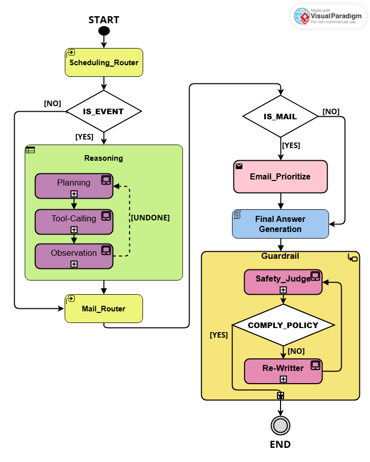

# scheduling_agent
An agent to do scheduling &amp; email checking

# Overview  

## Objective

- The scheduling agent aims to help user process daily emails and deal with event arrangement.  
- The agent will prioritize each of email by the content of email.

---

## Agent Architecture

### Input
- Emails & Natrual Language Conversation probably will be needed in this case.



### Schedule_Router
- A router LLM to decide if the given content (email or conversation) is about scheduling an event.
  - **If 'YES'**, agent start reasoning to deal with event arrangement.
  - **If 'No'**, agent skip reasoning process.

---

### Reasoning
- It is a process of ReAct pattern (Thought->Action->Observation) allowing agent the think and calling necessary tools based on the given content and objective.

**(1) Planning**
- Agent generates *thought* and *Action* based on current status.

**(2) Tool-Calling**
- Agent calls tools through MCP with parameters generated from previous planning step.

**(3) Observation**
- It is the result after calling a MCP tool.  
- The observation will be recorded so that the next round of reasoing will generate output based on the updated current status.

---

### Mail_Router
- A router LLM to decide if the given content is an email.
  - **If 'Yes'**, agent start prioritizing the given email by classifying types of email and scoring the email from 1 to 5.  
  - **If 'No'**, agent skip prioritizing process.

---

### Email_Prioritize
- Define types of email, and score email from 1 to 5 based on the given content.
  - **Type**: 急件, 一般, 詢價, 會議邀約, 垃圾  
  - **Score**: 1 to 5 (from low to high priority)

---

### Final Answer Generation
- This is a step to generate agent final response by referring all of previous reults  
  (reasoning, chat_history, message).

---

### Guardrail

**Safety_Judge**
- The final response will be given, and a LLM will be applied to judge and check if the given content violate safety policies.
  - **If 'Yes'**, Safety_Judge should provide brief explaination and suggestion.  
  - **If 'No'**, The final response will be shown as agent replies.

**Re-writter**
- The final response and judge feedback will be given.
- It's supposed to re-write the given content based on feedback and send the output to Safety_Judge again.


# Getting Start
To run scheduling agent, suggest to use ```python 3.13.10```.

- **Installation**  
      use the following command to install packages.  
      ``` pip install -r requirements.txt ```

- **Run MCP Server**  
      Running on local ```127.0.0.1:8000/mcp```  
      ``` python Server/mcp_server.py ```

- **Setting LLM Services**  
      Scheduling Agent applies Gemini as core LLM.  Please refer to [AI Studio](https://aistudio.google.com/) to get Gemini API key.  
      [AI Studio](https://aistudio.google.com/) provides free API key with limited tokens and billing API, please make sure your API Key is available and tokens are enough for running agent.  
      When having Gemini API key, input API key and model name in ```config/config.yaml```, ```gemini-2.5-flash``` is suggested.

- **Run Agent**  
   Activate agent to process emails.  
   ```python run_agent.py```

- **Logging**  
   The Agent Response and Reasoning process will be logged and saved at ```./logs/```(default).  
   - ```E2E_log.txt```: record only input message and agent End-to-End response.  
   - ```agent_reasoning_log```: record status of whole agent reasoning process, including input message/routering/planning/tool-calling/observation/guardrail/final response.  


# Prompting
